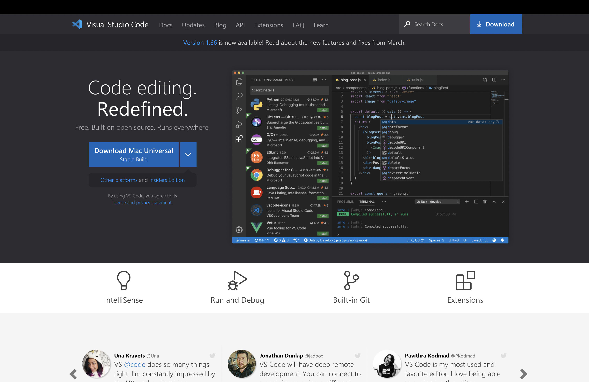
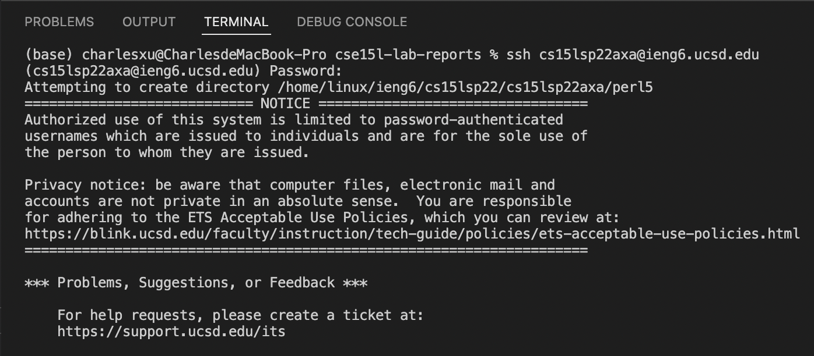
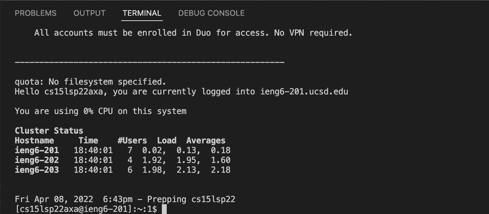
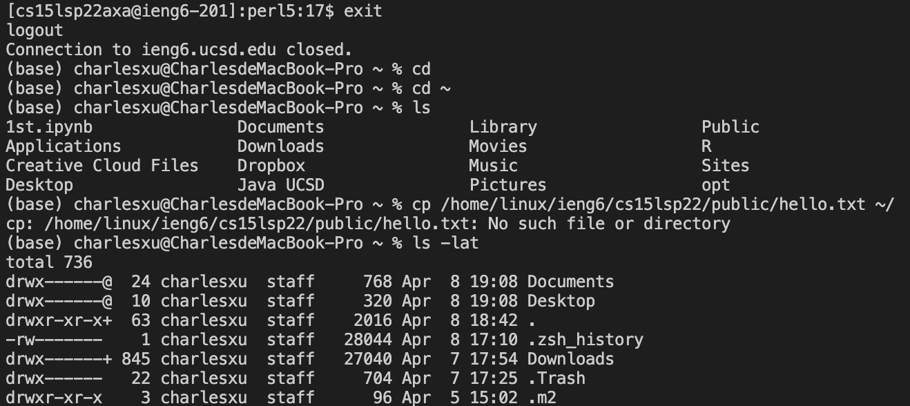

# Lab Report 1 Week 2
April 10th, 2022
Tianyang Xu

This lab report includes the following sections:
- Installing VS Code
- Remotely Connecting
- Trying Some Commands
- Moving Files with scp
- Setting an SSH Key
- Optimizing Remote Running

--- 

## Installing VS Code

1. To install Visual Studio Code, first visit the [webiste](https://code.visualstudio.com).

2. Click the blue download button to download VSCode. Since I am using a MacBook, I downloaded the Mac Univseral version. 

3. Once downloaded from the website, follow the instruction and finish intalling on the computer. 

## Remotely Connecting

1. To remotely connect with the server computer, I first found my username from this [website](https://sdacs.ucsd.edu/~icc/index.php)

2. Then, I typed `ssh cs15lsp22<username>@ieng6.ucsd.edu` and entered password, which successfully connect my terminal with the server computer as shown below.

## Trying Some Commands
Here is some commmands I tried on the server computer. 

Here is some commands I tried on my Mac after I disconnect from the server computer using "exit" command. 

## Moving Files with scp

## Setting an SSH Key

## Optimizing Remote Running
