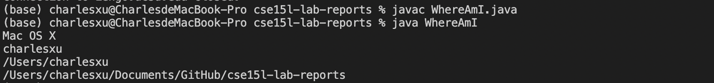
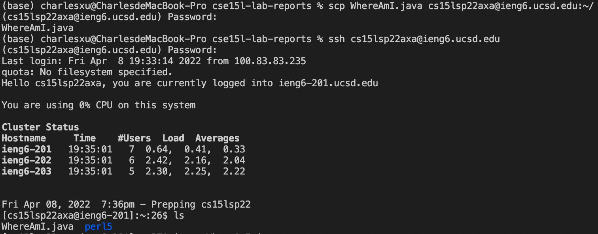
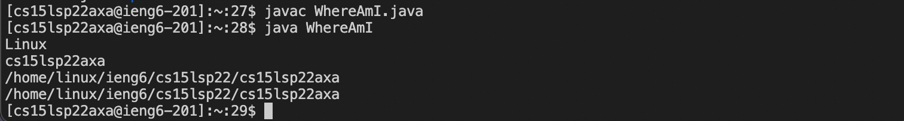

# Lab Report 1 Week 2
April 10th, 2022
Tianyang Xu

This lab report includes the following sections:
- Installing VS Code
- Remotely Connecting
- Trying Some Commands
- Moving Files with scp
- Setting an SSH Key
- Optimizing Remote Running

--- 

## Installing VS Code


1. To install Visual Studio Code, first visit the [webiste](https://code.visualstudio.com).

2. Click the blue download button to download VSCode. Since I am using a MacBook, I downloaded the Mac Univseral version. 

3. Once downloaded from the website, follow the instruction and finish intalling on the computer. 

--- 

## Remotely Connecting

1. To remotely connect with the server computer, I first found my username from this [website](https://sdacs.ucsd.edu/~icc/index.php)

2. Then, I typed `ssh cs15lsp22<username>@ieng6.ucsd.edu` and entered password, which successfully connected my terminal with the server computer as shown below.


--- 

## Trying Some Commands
- Here is some commmands I tried on the server computer, including cd, cd ~, ls, ls -lat, ls -a. 


- I tried the above commands on my Mac after I disconnect from the server computer using "exit" command. Here is the result. These commands behave very similarly on both computers. 


--- 

## Moving Files with scp
- To copy a file from client to server, I created a new java file called `WhereAmI.java` which contains following codes:
```
class WhereAmI {
    public static void main(String[] args) {
      System.out.println(System.getProperty("os.name"));
      System.out.println(System.getProperty("user.name"));
      System.out.println(System.getProperty("user.home"));
      System.out.println(System.getProperty("user.dir"));
    }
  }
```

- Then, I compiled and ran the program on my computer, it returns information about my computer. 


- I copied the file from my computer to the server using `scp WhereAmI.java cs15lsp22zz@ieng6.ucsd.edu:~/` command. To verify, I connected with server again using `ssh` commmand and found the `WhereAmI.java` using `ls`. 


- I compiled and ran the file on the server and got information about the server computer as expected.


---

## Setting an SSH Key


## Optimizing Remote Running
