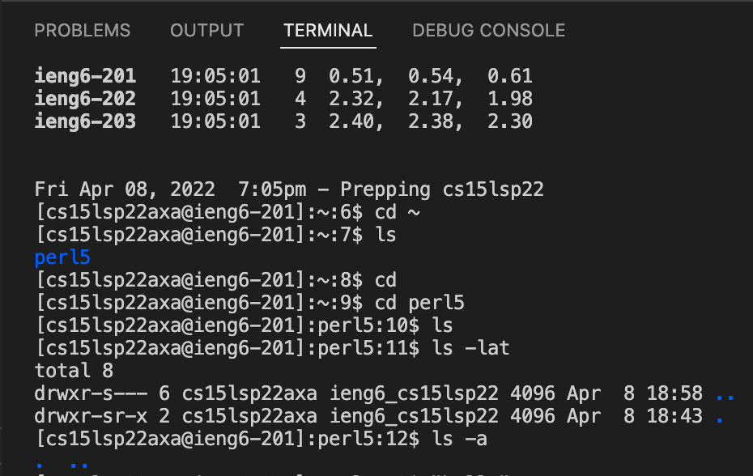

# Lab Report 1 Week 2
April 10th, 2022. Tianyang Xu. 

This lab report includes the following sections:
- Installing VS Code
- Remotely Connecting
- Trying Some Commands
- Moving Files with scp
- Setting an SSH Key
- Optimizing Remote Running

--- 


## Installing VS Code


1. To install Visual Studio Code, first visit the [webiste](https://code.visualstudio.com).

2. Click the blue download button to download VSCode. Since I am using a MacBook, I downloaded the Mac Univseral version. 

3. Once downloaded from the website, follow the instruction and finish intalling on the computer. 

--- 


## Remotely Connecting

1. To remotely connect with the server computer, I first found my username from this [website](https://sdacs.ucsd.edu/~icc/index.php). 

2. Then, I typed `ssh cs15lsp22<username>@ieng6.ucsd.edu` and entered password, which successfully connected my terminal with the server computer as shown below.  

--- 


## Trying Some Commands
- Here are some commmands I tried on the server computer, including cd, cd ~, ls, ls -lat, ls -a. 

- I disconnect from the server computer using "exit" command and tried the above commands on my Mac. Here is the result. These commands behave very similarly on both computers. 


--- 


## Moving Files with scp
1. To copy a file from client to server, I created a new java file called `WhereAmI.java` which contains following codes:
```
class WhereAmI {
    public static void main(String[] args) {
      System.out.println(System.getProperty("os.name"));
      System.out.println(System.getProperty("user.name"));
      System.out.println(System.getProperty("user.home"));
      System.out.println(System.getProperty("user.dir"));
    }
  }
```

2. Then, I compiled and ran the program on my computer, it returned information about my computer. 


3. I copied the file from my computer to the server using `scp WhereAmI.java cs15lsp22zz@ieng6.ucsd.edu:~/` command. To verify, I connected with server, entered `ls` command, and found the `WhereAmI.java` file. 

4. I compiled the file, ran it on the server, and got information about the server computer as expected. 

---


## Setting an SSH Key
- SSH key allows users to connect with server without entering passwords. Client computer will store a private key, and the server will store the public key. Whenever client try to connect with the the server, user no longer needs to enter passwords as long as the private key matches with the public key. 

1. To do so, I first generated a ssh-key on the client and the save the public key in my computer. 

2. I logged into server, created a new directory called `.ssh`, and logged out from the server. 

3. I copied the public key from client to the directory `.ssh` that I just created in server. Now, when I try to connect with the server, I will be no longer asked to enter passwords. 

---


## Optimizing Remote Running
- By now, I have ran commands by logging into the server. However, it is possible to run commands on remote server without logging in every time. To achaieve this, type the follwing code `ssh cs15lspzz@ieng6.ucsd.edu "command"`, where "command" is the command you wish to run. Here are two simple examples. 

1. I can remotely list all the files in server by entering '`ssh cs15lspzz@ieng6.ucsd.edu "ls"`. 

2. Remember the `WhereAmI.java` I created in the previous section. I can remotely compile and run the `WhereAmI` file by simply entering `ssh cs15lsp22axa@ieng6.ucsd.edu "javac WhereAmI.java; java WhereAmI"`. 

---


