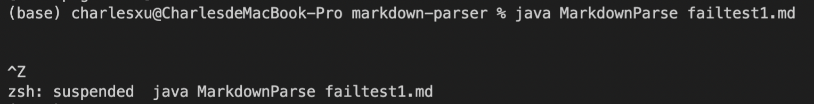

# Lab Report 2 Week 4
April 24th, 2022. Tianyang Xu. 

This lab report includes three code changes for MarkdownParse file which has the following symptoms:
- Infinite loop caused by incorrect index (failtest1)
- Infinite loop caused by false recognition of parenthesis (failtest2)
- Falsely read image as a link (failtest3)

All of the test and code changes are stored in my repository. 
For each code change, I will include 
1. a screenshot of code change diff from Github
2. link to the failed test file
3. output on the command line for the failed test
4. Brief explaination for the relation among symptom, bug, and failure-inducing input.

--- 

## Infinite loop caused by incorrect index 
1. code change diff

2. [failtest1](https://github.com/Char15Xu/markdown-parser/blob/main/failtest1.md)

3. Output

4. When running the failtest1, the command line will not return any output, which is the symptom. This program will go into an infinite loop, which is the bug that caused the symptom. The currentIndex is always set to closeParen + 1 after each while loop. This is the failure-inducing input. It means that the currentIndex will not increase if the program cannot find another pair of bracket and parenthesis. Therefore, the currentIndex will always be smaller than the total size of markdown file which is called by markdown.length() if the last string in the file is not a closeParen. So the while loop will keep running and go into an infinite loop. In the terminal, nothing will be returned unless we manually stop the program. 

---

## Infinite loop caused by false recognition of parenthesis
1. code change diff

2. [failtest2](https://github.com/Char15Xu/markdown-parser/blob/main/failtest2.md)

3. Output

4. As long as the program is not empty, currentIndex will always be smaller than markdown.length(), so the while loop will always run. In the while loop, the code is always finding the open bracket first. If there does not exist a open bracket, the program will go into a infinite loop. Like failtest1, The symptom is not showing anything in the terminal. The bug is that the program will go into an infinite while loop. The failure-inducing input is the poorly defined currentIndex and the while loop. The failure-inducing input created the bug, and the bug caused the symptom. 

---

## Fasely read image as a link
1. code change diff

2. [failtest3](https://github.com/Char15Xu/markdown-parser/blob/main/failtest3.md)

3. Output

4. According to the markdown file syntax, ! + [] + () is used for creating an image. However, since the program only reads the brackets and parenthesis as indicator for link, it falsely output the image path inside the parenthesis as a link. The symptom is the incorrect output in the terminal. The bug is that the code ignore the similar syntax  between embeding a link and embeding an image. The failure-inducing input is the incomplete defined method for MarkdownParse. 