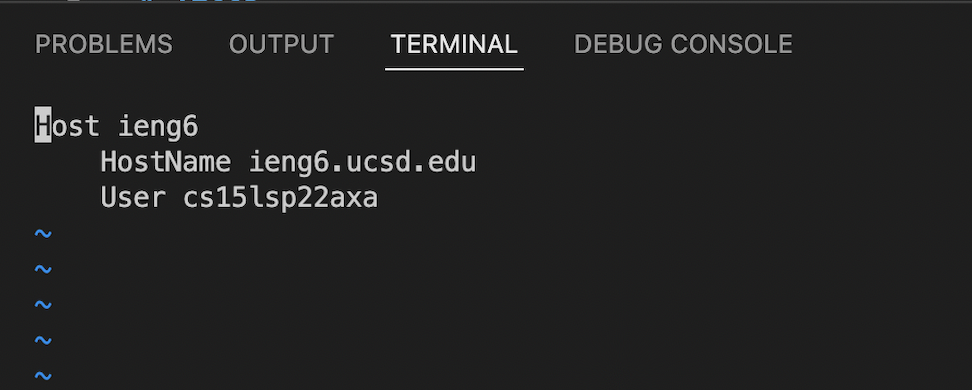
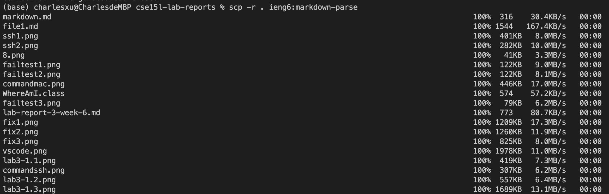
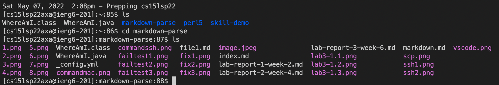
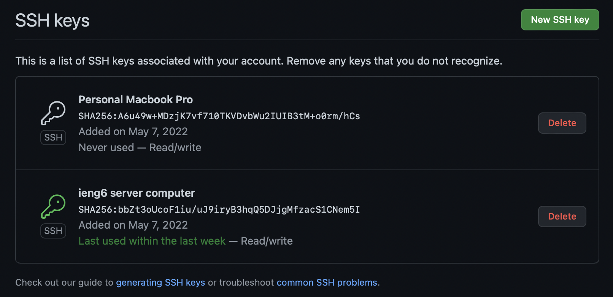
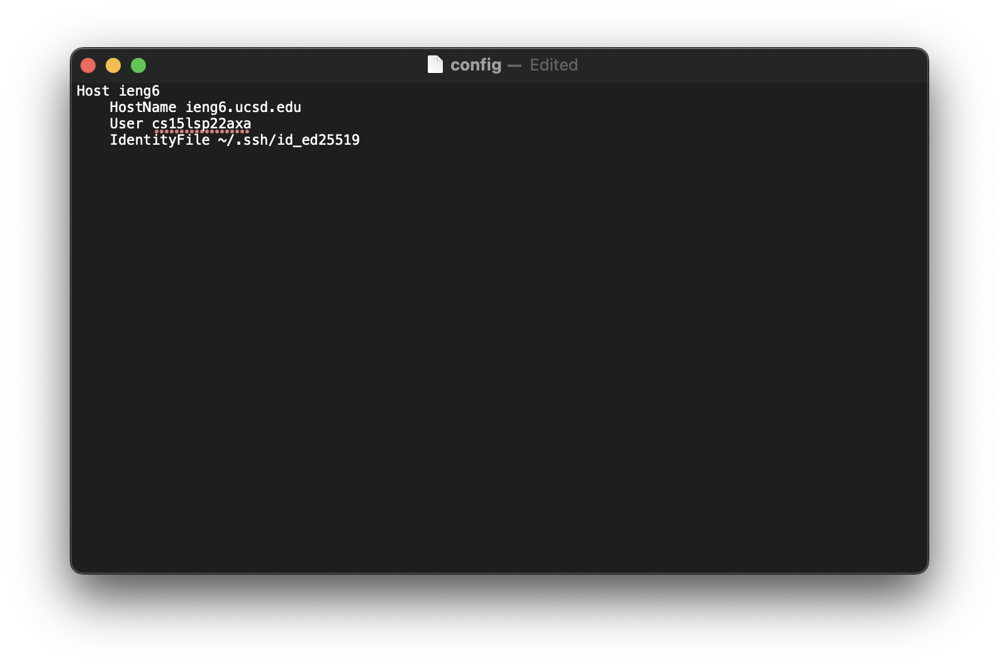
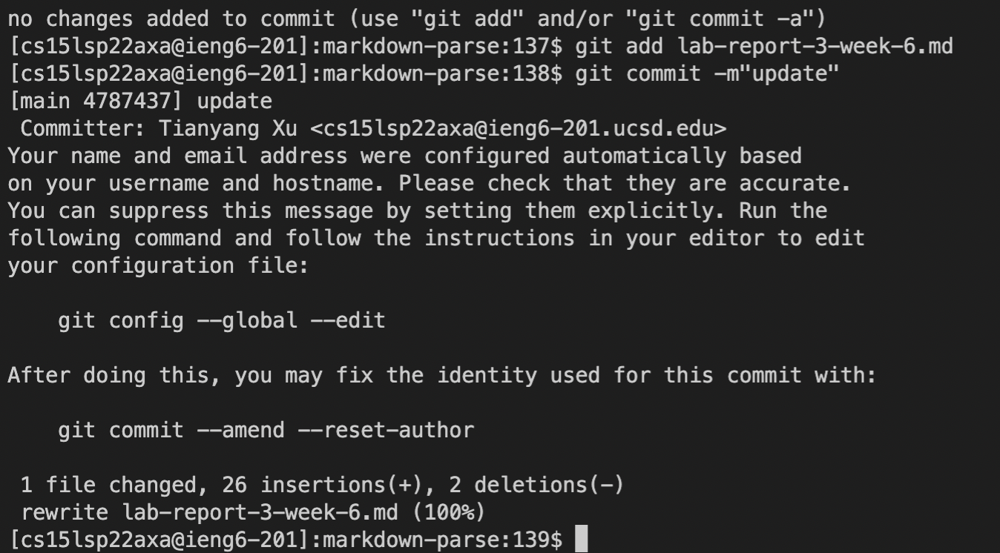
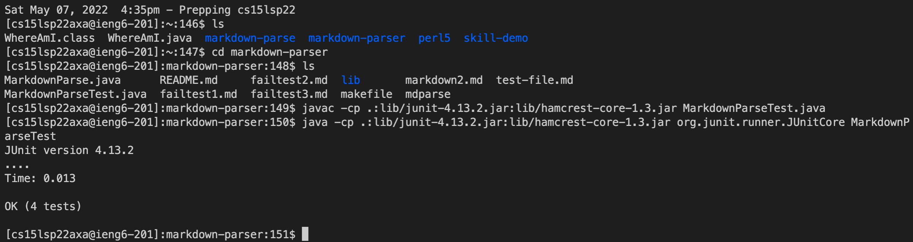
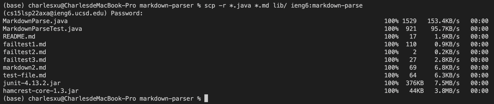

# Lab Report 3 Week 6
May 7th, 2022. Tianyang Xu. 

This report will include three sections:
- Streamlining ssh Configuration
- Setup Github Access from ieng6
- Copy whole directories with `scp -r`

--- 

## Streamlining ssh Configuration
1. First, I changed into the .ssh directories on my local computer using the command `cd .ssh`. Then, using `vim config` to edit the config file. 

2. I copied the codes from lab 5 writeup into config file.

3. By entering the `ssh ieng6`, I can now connect to the remote server easily.

4. Moreover, I am able to copy the whole directory from my local computer to the remote server using a single command. You can see from the below images, all files in the markdown-parse have been copied from my local computer to the remote server. 

---

## Setup Github Access from ieng6
1. First, here is the SSH keys stored on Github

2. Then, the private key is stored in the .ssh/config file

3. Using the ieng6 server computer, I can commit a change of file to Github. Here is the commit [Link](https://github.com/Char15Xu/markdown-parser/commit/018d1212d422a55b3ad1e5b3243ee647091567b8) and the commit command in the below picture. 

---

## Copy whole directories with `scp -r`
1. In the first section, I have already copied a whole directory from local computer to the ieng6 computer using the `scp -r` command. 

2. Now, I will compile and run the test on ieng6 server. 

3. Finally, I can copy from local computer to the remote computer using a single line of command.

---

[Back to main page](https://char15xu.github.io/cse15l-lab-reports/)