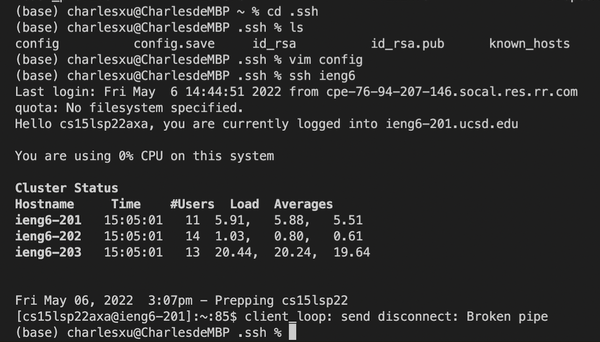

# Lab Report 3 Week 6
May 7th, 2022. Tianyang Xu. 

This report will include three sections:
- Streamlining ssh Configuration
- Setup Github Access from ieng6
- Copy whole directories with `scp -r`

--- 

## Streamlining ssh Configuration
1. First, I changed into the .ssh directories on my local computer using the command `cd .ssh`. Then, using `vim config` to edit the config file. 

2. I copied the codes from lab 5 writeup into config file.

3. By entering the `ssh ieng6`, I can now connect to the remote server easily.

4. Moreover, I am able to copy the whole directory from my local computer to the remote server using a single command. You can see from the below images, all files in the markdown-parse have been copied from my local computer to the remote server. 

---

## Setup Github Access from ieng6
1. 

[Back to main page](https://char15xu.github.io/cse15l-lab-reports/)