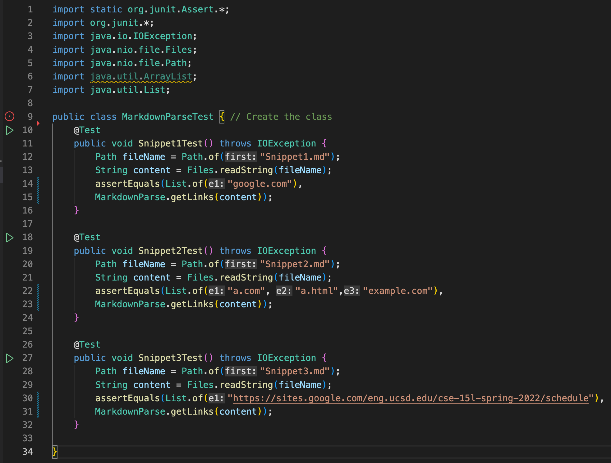
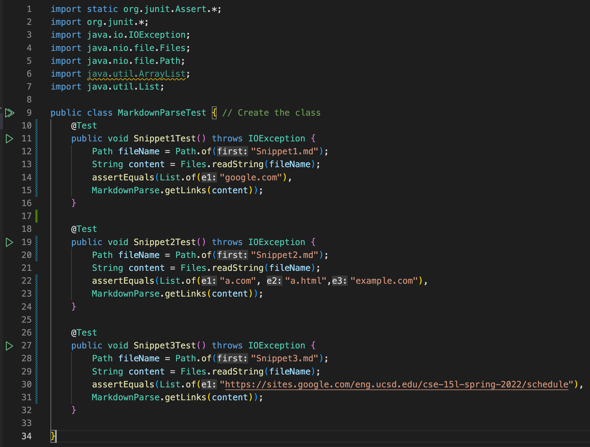
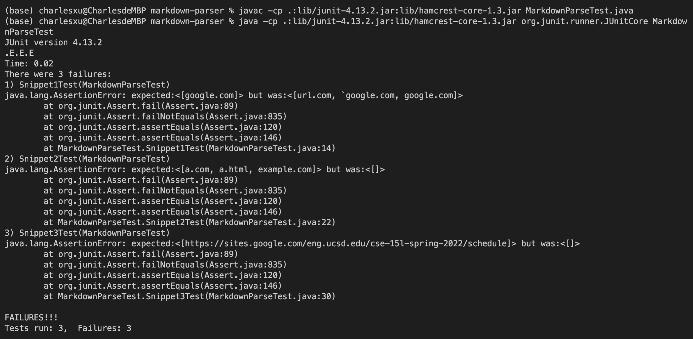

# Lab Report 4 Week 8
May 22th, 2022. Tianyang Xu. 

This report will include three sections:
- Links to the repositories needed for this lab report
- Implementation and tests for the Snippet files and corresponding result
- Discussion on why the tests passed/failed on my MardownParse file

--- 

## Links
Below are the link to my repository and the repository I reviewed
My repository: [Link] (https://github.com/Char15Xu/markdown-parser)
The one I reviewed: [Link] (https://github.com/aHewig/markdown-parser)

--- 

## Testing
1. First, I added the three Snippet files into both repositories and used the CommonMark website to determine the correct output for each Snippet files.

2. Then, I wrote three tests for each of the Snippet files according to the corret expected output. Below are the tests I wrote for each of the repositories. They are essentially the same. 
Tests I wrote for my repository

    Tests I wrote for the repository I reviewed

3. I ran the test files first on my repostiroy, and here are the JUnit test output for each part of the test.

4. I ran the test files again on the repostiroy I reviewed, and here are the JUnit test output for each part of the test.

--- 

## Discussion

1. For Snippet 1, I do think there is a small change that I can do to fix the wrong output. To get the correct output for Snippet 1, I must check the open bracket and the open parentheses does not come after a ', single quotation mark, and close bracket is not followed by a ', single quotation mark. To do so, I can simply write a if statement to check whether this condition holds so that only the valid link will print out. 

2. For Snippet 2, I do not think there is a small change I can do to fix the wrong output. The only solution is to write codes that allow nested bracket. Right now, my code only looks for the first open and close bracket. My code does not consider situations for more than one pair of bracket exist. To have correct output, I need to rewrite the entire logic for my bracket search. I can use stack to find the pairs of bracket, but I do not think a small change can fix this issue. 

3. I do not think there is a small change that can fix the problem for Snippet 3. My code looks for the next closing bracket and closing parenthese after the open bracket and open parenthese. To fix the issue, I also need to rewrite the logic for finding brackets and parentheses. 