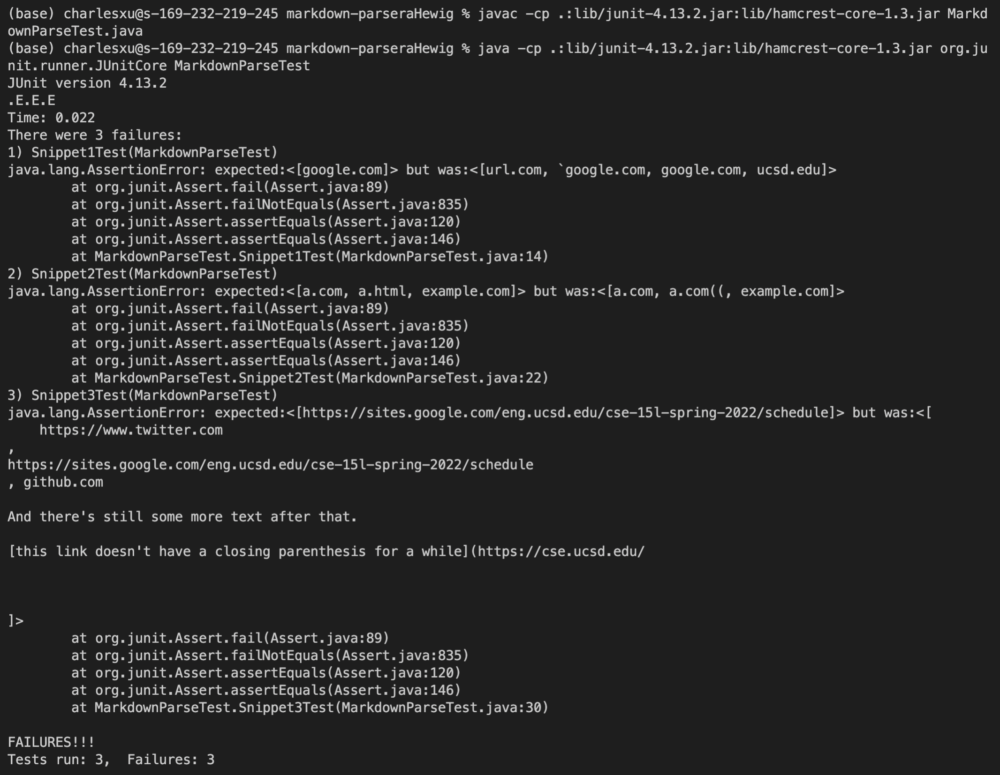

# Lab Report 4 Week 8
May 22th, 2022. Tianyang Xu. 

This report will include three sections:
- Links to the repositories needed for this lab report
- Implementation and tests for the Snippet files and corresponding result
- Discussion on why the tests passed/failed on my MardownParse file

--- 

## Links
Below are the link to my repository and the repository I reviewed
My repository: [Link] (https://github.com/Char15Xu/markdown-parser)
The one I reviewed: [Link] (https://github.com/aHewig/markdown-parser)

--- 

## Testing
1. First, I added the three Snippet files into both repositories and used the CommonMark website to determine the correct output for each Snippet files.

2. Then, I wrote three tests for each of the Snippet files according to the corret expected output. Below are the tests I wrote for each of the repositories. They are essentially the same. 
Tests I wrote for my repository

    Tests I wrote for the repository I reviewed

3. I ran the test files first on my repostiroy, and here are the JUnit test output for each part of the test.

4. I ran the test files again on the repostiroy I reviewed, and here are the JUnit test output for each part of the test.

--- 

## Discussion

1. For Snippet 1, 